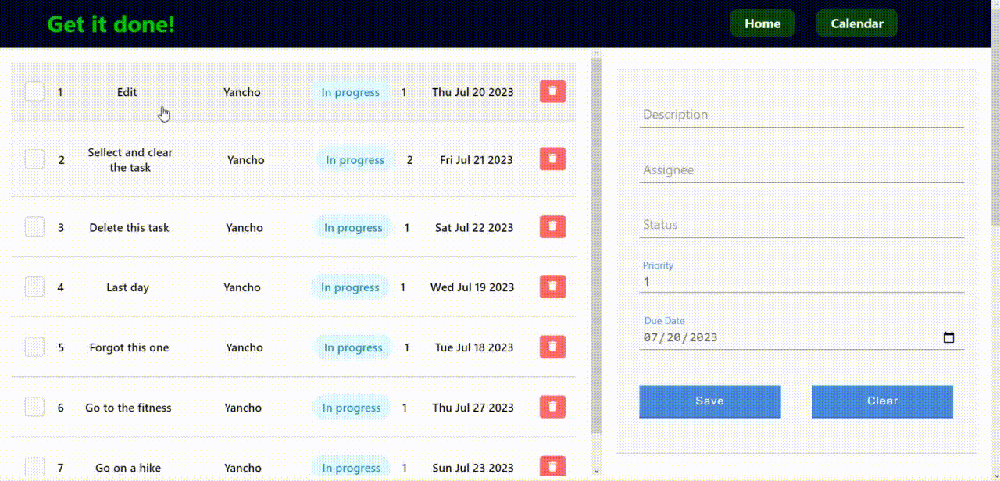
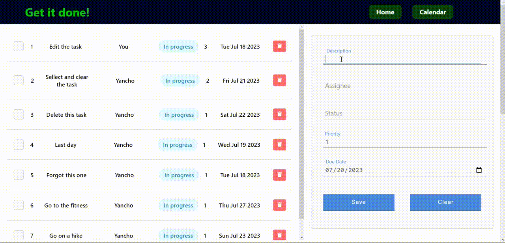
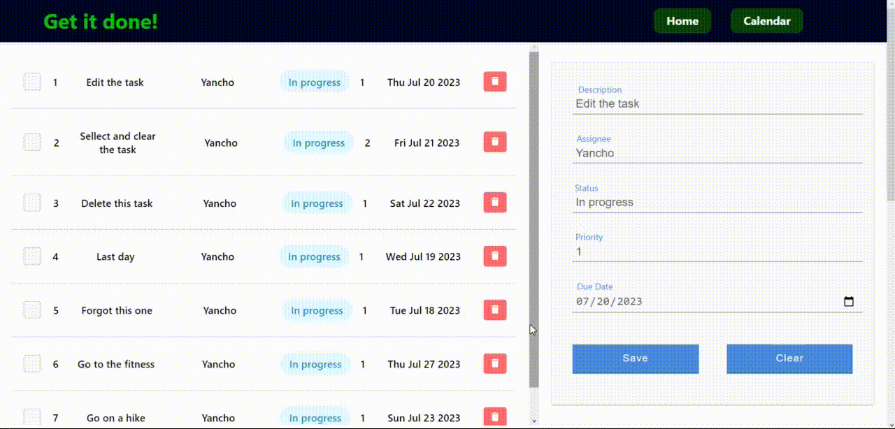
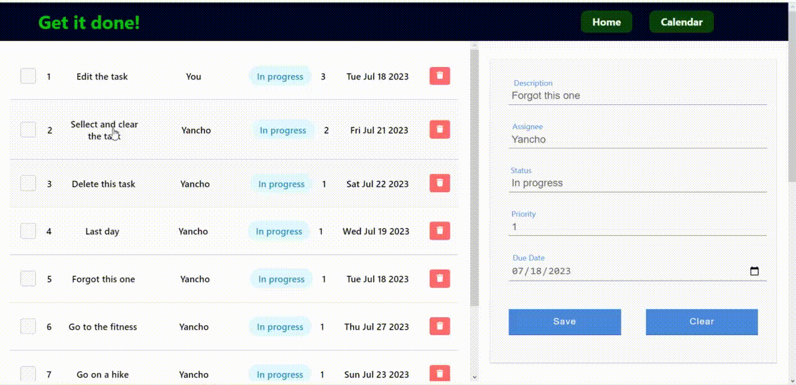
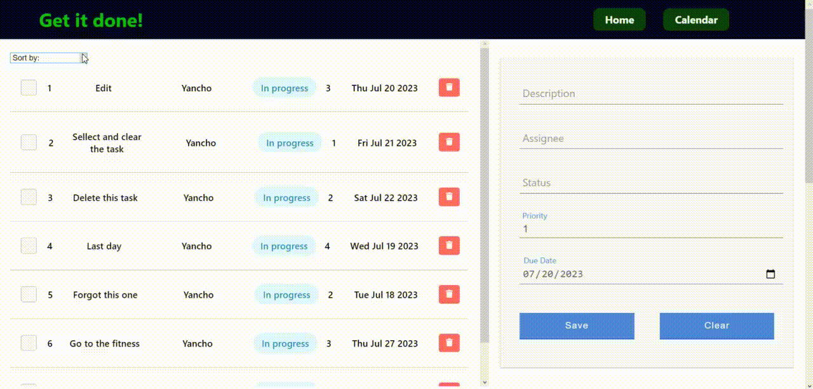
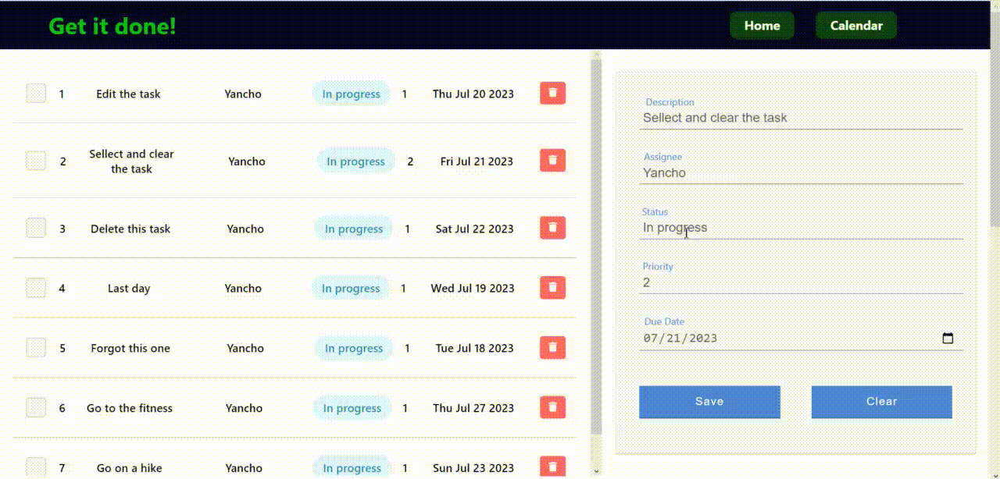

# Task Manement System
The Task Management System is a simple Single Page Application (SPA) built using React, designed to help users and teams efficiently manage their tasks and stay organized. This application allows users to create, read, update, and delete tasks, along with a convenient calendar preview for better scheduling.
## How to Use
- Clone this repository to your local machine using ```git clone https://github.com/YanchoK/task-manegment.git```
- Install the required dependencies using ```npm install```
- Start the development server with ```npm start```
- Open your web browser and navigate to http://localhost:3000 to access the application
## Content
 1. Base functionality
	 - Selecting and editing task
	 - Selecting and clearing
	 - Creating task
	 - Deleting task	
 2. Aditional functionality
	 - Check task as completed
	 - Sorting tasks
	 - View tasks in the calendar
	 - Select and edit task in the calendar

## Base functionality
### Selecting and editing task

### Selecting and clearing

### Creating task

### Deleting task

## Aditional functionality
### Check task as completed

### Sorting tasks

### View tasks in the calendar

### Select and edit task in the calendar

