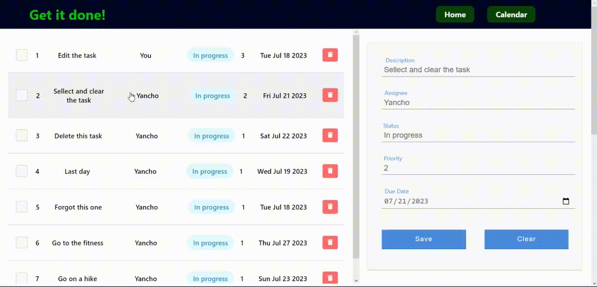
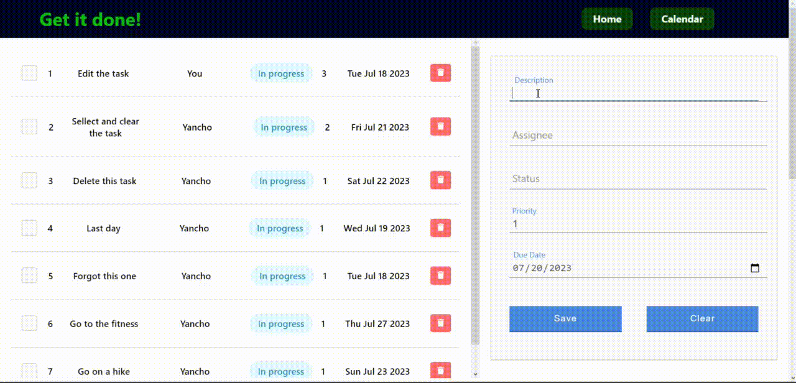
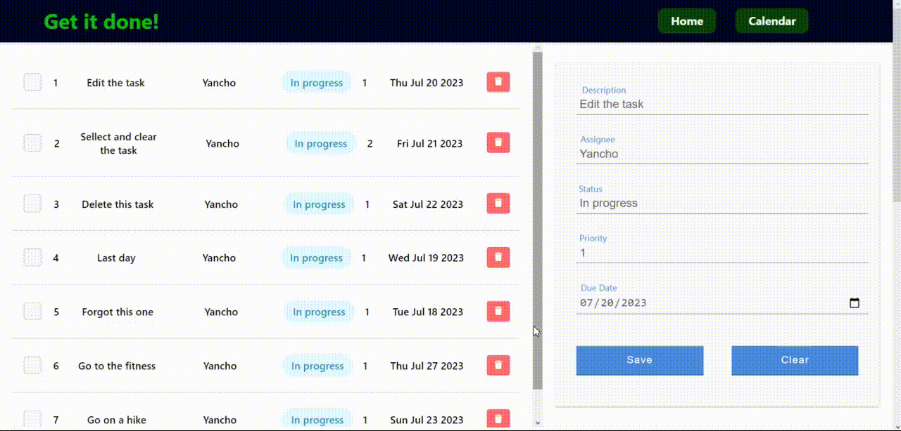
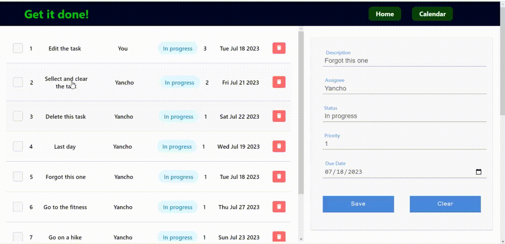
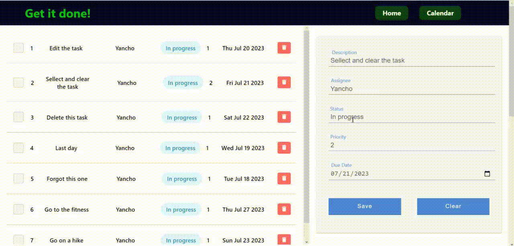

# Task Manement System
## Content
 1. Base functionality
	 - Selecting and editing task
	 - Selecting and clearing task
	 - Creating task
	 - Deleting task	
 2. Aditional functionality
	 - Check task as completed
	 - View tasks in the calendar
	 - Select and edit task in the calendar

## Base functionality
### Selecting and editing task

### Selecting and clearing task

### Creating task

### Deleting task

## Aditional functionality
### Check task as completed

### View tasks in the calendar

### Select task in the calendar
